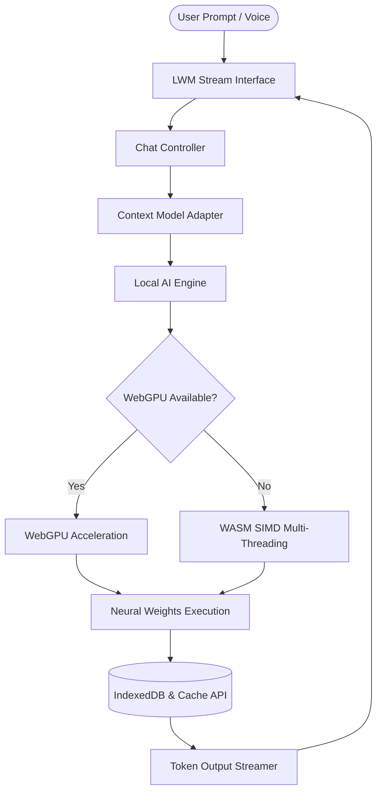

# LWM (Learn With Me)

<div align="center">


### ⚡ 100% Offline Private In-Browser AI Execution Engine

[](#architecture)
[](#privacy)
[](#storage)
[](#author)

</div>

---

## 🌟 Overview

**LWM (Learn With Me)** is a high-performance, browser-native artificial intelligence application created by **Niranjan Kumar K** (Father of the K programming language and Architect of KNI OS). Powered by modern WebGPU acceleration and multi-threaded WASM SIMD, LWM executes quantized neural language models entirely on client hardware, eliminating cloud dependencies, server latency, and privacy risks by performing 100% of tensor operations locally inside your device's web browser.

---

## ✨ Key Features & Enhancements

- **⚡ WebGPU & WASM Acceleration**: Direct GPU tensor computation via WebGPU API with automatic fallback to multi-threaded WASM SIMD.
- **🔒 Absolute Privacy & Offline Security**: Zero telemetry, zero external API calls, and zero data transmission. All user prompts and model weights remain inside your browser storage.
- **🎙️ Real-Time Hands-Free Voice AI Mode**: Interactive voice-to-voice chat overlay featuring a glowing animated Audio Orb (Listening, Thinking, Speaking) powered by Web Speech APIs.
- **🧠 Animated "Thinking • • •" Indicator**: Modern React-style pulsing dot loader for an authentic real-time AI feel during token generation.
- **⚙️ Model Generation Settings (⚙️)**: Fine-tune model parameters with Emerald Green sliders and badges for Temperature (0.0 to 1.0), Top-P Nucleus Sampling (0.1 to 1.0), Max Tokens Limit (64 to 2048), Repetition Penalty (1.0 to 1.5), and Custom System Instruction Prompts.
- **📦 Curated Model Store**: Download, inspect, and switch between state-of-the-art open-source LLMs:
  - 🥇 **Qwen3 4B Instruct (2507)** (Recommended flagship model)
  - 🥈 **Qwen3 8B** (Ultra-high accuracy parameter model)
  - 🥉 **Llama 3.1 8B Instruct** (Premier Meta instruction model)
  - **Qwen2.5 7B Instruct**
  - **Qwen3 1.7B**
  - **Qwen 1.5 0.5B Chat** (390 MB compact choice)
  - **Qwen 2.5 0.5B Instruct** (380 MB lightweight choice)
- **📬 Developer Support & Report Session**: Direct issue reporting modal with web-native Gmail Web compose tab launcher (`hackerenvironment1514@gmail.com`), direct WhatsApp link (`+91 9515888385`), and LinkedIn connection link (`https://linkedin.com/in/hacker1514`).
- **🎨 Sleek Clean UI**: Invisible scrollbars with full smooth wheel/touch scrolling, fixed non-resizable textareas, and pure dark theme styling.

---

## 🏗️ System Architecture



---

## 🚀 Quick Start Guide

### Prerequisites

- Modern Web Browser with **WebGPU** enabled (Chrome 113+, Edge 113+, or Brave).
- Local HTTP Web Server (Node.js `http-server`, Python `http.server`, or Live Server).

### Installation & Launch

1. Clone or download the repository to your local directory:
   ```bash
   git clone https://github.com/hacker1514/offline_ai.git
   cd offline_ai
   ```

2. Launch a local web server:
   ```bash
   npx http-server . -p 1514
   ```

3. Open your browser and navigate to:
   ```text
   http://localhost:1514
   ```

4. Open the **Model Store**, select a model, and click **Download**. Once installed, start chatting 100% offline!

---

## 📁 Repository Structure

```text
c:\ai\
├── index.html            # Main single-page application shell
├── sw.js                 # Service worker PWA offline cache engine
├── css/
│   └── styles.css        # Pure dark theme, modal styles, & non-resizable controls
├── js/
│   ├── app.js            # Boot sequence & hardware initializer
│   ├── ai-engine.js      # WebGPU / WASM neural pipeline execution engine
│   ├── chat-controller.js# Streaming chat controller, Voice Mode, & Thinking loader
│   ├── db.js             # IndexedDB transactional database controller
│   ├── download-manager.js# Background chunked model weight loader
│   ├── model-adapter.js  # Multi-turn prompt formatting & token context manager
│   ├── model-resolver.js # Model state & cache validator
│   ├── storage-manager.js# Browser quota calculator & persistent storage manager
│   ├── ui-manager.js     # View routing, Report Problem modal & settings
│   ├── registry.js       # Curated 0.5B to 8B model registry definitions
│   ├── config.js         # Global platform configuration & Niranjan's system prompt
│   ├── diagnostics.js    # System diagnostic metrics generator
│   └── performance.js    # Inference TPS throughput metrics tracker
└── assets/
    ├── logo.svg          # LWM emblem
    └── icon.svg          # Platform icon
```

---

## 💻 Tech Stack

- **Frontend**: HTML5, CSS3 Variables, Native ES6 Modules
- **Execution Runtimes**: WebGPU API, WebAssembly (WASM) SIMD
- **Storage Layer**: IndexedDB API, Cache Storage API, StorageManager API
- **Markdown & Code Highlighting**: Marked.js, Highlight.js (Tokyo Night Dark Theme)

---

## 👤 Author & Contact

**LWM (Learn With Me)** is designed and developed by **Niranjan Kumar K**.

- **Creator**: Niranjan Kumar K (Father of K programming language & KNI OS)
- **Email**: [hackerenvironment1514@gmail.com](mailto:hackerenvironment1514@gmail.com)
- **WhatsApp**: [+91 9515888385](https://wa.me/919515888385)
- **LinkedIn**: [linkedin.com/in/hacker1514](https://linkedin.com/in/hacker1514)
- **License**: MIT License

---

<div align="center">
  <sub>LWM (Learn With Me) — Built with precision for 100% private, local WebGPU AI execution.</sub>
</div>
